Below is an **updated Architecture Document** that incorporates the **advanced analytics** features (homomorphic encryption and multi-party computation), **microservice refactoring**, **cross-chain bridging**, the **Go microservice** handling more business logic (beyond just bridging), and the **Next.js** front end with progressive web app (PWA) capabilities. This version unifies our previously detailed architecture with these newly requested expansions and clarifications.

---

# 1. Introduction

## 1.1 Purpose

This document defines the **unified technical architecture** for our healthcare blockchain system. It integrates:

1. **Hyperledger Fabric** as the core permissioned blockchain.  
2. A **Go-based microservice** responsible for bridging to Fabric **and** incorporating additional business logic.  
3. A **Python-based microservice** for cryptographic tasks, application logic, and advanced analytics.  
4. A **Next.js** front end with PWA features for patient portals, EHR dashboards, etc.  
5. Off-chain storage and future expansions (privacy-preserving analytics, cross-chain bridging).

## 1.2 Scope

- **In scope**:  
  - All microservices (Go + Python).  
  - Front-end architecture using **Next.js** (PWA).  
  - Blockchain layer (Fabric).  
  - Off-chain storage (IPFS, databases) and advanced analytics.  
- **Out of scope**:  
  - Deep UI/UX design details (though we reference Next.js approach).  
  - Detailed chaincode logic (documented separately).  
  - Organizational policies around governance (though we reference best practices).

---

# 2. Key Architectural Goals

1. **Regulatory Compliance (HIPAA/GDPR)**: Secure management of patient data and granular consent controls.  
2. **Scalability & Modularity**: Each microservice can be deployed and scaled independently; blockchain can add more peers.  
3. **Advanced Analytics & Privacy**: Enable **homomorphic encryption (HE)** or **multi-party computation (MPC)** for privacy-preserving queries on aggregated data, without exposing raw PHI.  
4. **Cross-Chain Extensibility**: Future bridging to other blockchains (e.g., Quorum, Ethereum) with minimal rework.  
5. **Frontend Modernization**: Use **Next.js** for a responsive, PWA-enabled front end, ensuring a polished user experience.

---

# 3. High-Level System Diagram

```mermaid
flowchart LR
    subgraph FE["Next.js Frontend (PWA)"]
        direction TB
        FE1["Patient Portal"]
        FE2["Provider/EHR Dashboard"]
        FE3["Admin Tools & Analytics UIs"]
    end

    subgraph PY["Python Microservice"]
      direction TB
      PY1["App & Consent Logic"]
      PY2["Advanced Crypto (ABE/HE/MPC/ZK)"]
      PY3["REST/GraphQL API"]
    end

    subgraph GO["Go Microservice (Bridging + Biz Logic)"]
      direction TB
      GO1["REST/gRPC Endpoints"]
      GO2["Hyperledger Fabric SDK"]
      GO3["Additional Domain Logic (Auth, etc.)"]
      GO4["(Future) Cross-Chain Adapters"]
    end

    subgraph FAB["Hyperledger Fabric Network"]
      direction TB
      FAB1["Orderers (Raft)"]
      FAB2["Peers (Endorsing/Committing)"]
      FAB3["Chaincode (Go/Node)"]
      FAB4["Membership Service Provider (MSP)"]
    end

    subgraph STORE["Off-chain Storage"]
      D1["IPFS (Large Files)"]
      D2["Databases (Encrypted)"]
    end

    FE --> PY
    PY --(REST/gRPC)--> GO
    GO --(Transactions/Queries)--> FAB
    FAB --> STORE
    PY --> STORE
```



---

# 4. Components & Responsibilities

## 4.1 Next.js Frontend (PWA)

- **Stack**: Next.js (React-based), TypeScript, PWA features (service workers, offline caching).  
- **Role**:
  - Patient portal for managing consents, viewing records.  
  - Provider/EHR dashboards for retrieving records, analyzing data.  
  - Admin consoles (audit logs, system metrics).  
- **Deployment**: Hosted on a Node.js environment or static site platform, with SSR (server-side rendering) for performance.  
- **PWA**: Allows offline capabilities, push notifications for updates, and mobile-friendly usage.

## 4.2 Python Microservice

- **Technologies**: FastAPI or Flask for HTTP endpoints, Python cryptographic libraries (Charm, PySEAL, etc.).  
- **Responsibilities**:
  1. **Business/Application Logic**: Coordinates creation of new records, updates to consent, partial data checks.  
  2. **Advanced Crypto**:
     - **Attribute-Based Encryption (ABE)**
     - **Homomorphic Encryption (HE)** for privacy-preserving computations on encrypted data.  
     - **Multi-Party Computation (MPC)** for collaborative analytics across multiple data owners.  
     - **Zero-Knowledge Proofs (ZKPs)** for selective disclosure.  
  3. **API Layer**: Presents a REST or GraphQL interface for the front end.  
  4. **Microservice Refactoring**: 
     - If cryptographic tasks become heavy, we can spawn a separate “crypto worker” microservice (still in Python) that the main Python app offloads tasks to, ensuring concurrency is managed effectively.

## 4.3 Go Microservice (Bridging + Additional Business Logic)

- **Technologies**: Go for concurrency, Hyperledger Fabric Go SDK for ledger operations, plus standard frameworks (Gin, Echo) for REST.  
- **Responsibilities**:
  1. **Blockchain Interfacing**: Submits transactions to Fabric, queries chaincode, manages membership credentials.  
  2. **Expanded Business Logic**: 
     - May handle user authorization checks, partial domain logic, or data transformations that are more conveniently done in Go.  
     - Can store partial ephemeral data (caches) for quick lookups before hitting the chaincode.  
  3. **Cross-Chain Bridges (Future)**:
     - Potential to add custom endpoints to interact with private Ethereum networks or public chains.  
     - Example: bridging consent tokens or hashed EHR references across multiple blockchain environments.
  4. **Security**: Ensures only trusted requests from the Python microservice or front end can call blockchain functions. Potential mutual TLS or shared secrets for internal traffic.

## 4.4 Hyperledger Fabric Network

- **Nodes**:
  - Orderers in **Raft** consensus for block ordering.  
  - Peers (each org runs endorsing peers + anchor peer).  
- **Chaincode**:
  - Written in Go or Node.js. Contains logic for EHR references, consent states, etc.  
- **Channels**:
  - E.g., a main “healthcare” channel for data among multiple hospital orgs. Additional channels for special subsets.  
- **MSP**:
  - Each org’s CA issues X.509 certificates. Endorsement policies ensure relevant org sign-off for transactions.

## 4.5 Off-Chain Storage

- **IPFS**:
  - Large files (radiology images, lab reports).  
  - Chaincode references IPFS CIDs.  
- **Databases**:
  - Possibly Postgres, CouchDB, or a NoSQL store for partial EHR fields, structured metadata, or analytics staging.  
  - All sensitive data is encrypted at rest.

---

# 5. Advanced Analytics & Privacy

## 5.1 Homomorphic Encryption (HE)

- **Use Cases**:
  - Aggregating encrypted lab results from multiple patients to compute an average or a sum without revealing individual values.  
  - Python microservice uses libraries like **Microsoft SEAL** (via PySEAL) or **HEAAN** wrappers.  
- **Flow**:
  - Encrypted data is stored off-chain or retrieved from peers.  
  - The Python service runs HE operations to produce aggregated results, then only the final result is decrypted (if authorized).

## 5.2 Multi-Party Computation (MPC)

- **Objective**:  
  - Multiple hospitals or orgs each hold private data sets. They collaboratively compute analytics or machine learning models without exposing raw data to one another.  
- **Architecture**:  
  - Python microservice orchestrates an MPC protocol (e.g., Sharemind or MP-SPDZ) with partial shares from each org.  
  - Each participant signs transaction references on the chain to record that they’re contributing data.  
  - The final computed result is stored or validated on-chain if needed.

## 5.3 Zero-Knowledge Proofs (ZKPs)

- **Selective Disclosure**:  
  - E.g., proving a patient meets certain criteria (age range, condition) without revealing all personal data.  
- **Implementation**:  
  - Python libraries for generating proofs (ZoKrates or custom libraries).  
  - The on-chain verification logic is minimal, or we store proof references.

---

# 6. Microservice Refactoring Plan

If cryptographic operations become too resource-intensive for a single Python service, we will:

1. **Split Off a “Crypto Worker”**: A separate Python microservice purely for CPU/GPU-heavy tasks (e.g., zero-knowledge proof generation, large HE computations).  
2. **Async Calls**: The main Python service sends tasks to a queue or gRPC endpoint in the crypto worker. This ensures the user-facing API remains responsive.  
3. **Scalability**: The crypto worker can scale horizontally (e.g., GPU-enabled nodes in Kubernetes), independent of the front-end or bridging services.

---

# 7. Cross-Chain Bridging (Future)

1. **Extended Go Service**: 
   - Implement extra modules to connect to other blockchain networks (Quorum, public Ethereum, etc.) using a relevant SDK (web3.go for Ethereum-like networks).  
   - Could store or read data from a second chain, bridging consent or tokenization logic across multiple ledgers.
2. **Possible Flow**:  
   - The Python service requests a bridging operation (“publish hash to public chain”).  
   - The Go service calls the second chain’s endpoint.  
   - Log bridging results on the main Fabric channel.

---

# 8. Front-End Details (Next.js + PWA)

1. **Next.js**:  
   - Server-side rendering or static generation for speed and SEO.  
   - TypeScript for maintainable code.  
   - Pages for patient login, consent management, record browsing, analytics dashboards.  
2. **PWA Features**:  
   - Service worker caching for offline usage of certain functionalities (e.g., local data forms, partial record viewing).  
   - Push notifications for record updates or urgent messages.  
3. **Interaction with Microservices**:  
   - The Next.js front end calls Python APIs for most business logic.  
   - Some direct calls to the Go microservice might exist for real-time chain status if needed, but typically the Python service orchestrates that.

---

# 9. Deployment & DevOps

## 9.1 Monorepo Structure (Updated)

```
/VitalMedChain
   ├── nextjs-frontend/         # Next.js code, PWA config
   ├── python-service/          # FastAPI + advanced crypto logic
   ├── go-service/              # Fabric bridging + additional domain logic
   ├── chaincode/               # Hyperledger Fabric chaincode
   ├── fabric-config/           # CA, peer, orderer config
   ├── docs/                    # Architecture docs, specs
   ├── tests/                   # Automated e2e tests
   ├── scripts/                 # Docker builds, deployment scripts
   └── README.md, LICENSE, ...
```

## 9.2 CI/CD Pipeline

1. **Lint & Test** each sub-project (ESLint for Next.js, Pytest for Python, Go tests, chaincode tests).  
2. **Build Docker Images**:
   - Next.js → Node environment.  
   - Python service → Docker with all crypto libraries installed.  
   - Go service → Minimal base image.  
3. **Integration Testing**:
   - Spin up a local Fabric network in Docker Compose or K8s test environment.  
   - Deploy chaincode, run end-to-end tests.  
4. **Deployment**:
   - Kubernetes recommended for production.  
   - Helm or custom YAML for each microservice + Fabric pods.  
   - PWA served by a Node-based or static hosting environment for Next.js.

## 9.3 Production Fabric Setup

- **Multi-Org**: Each org runs its own peers and CAs.  
- **Ordering Service**: 3–5 Raft nodes for HA.  
- **Channels**: One main channel for healthcare data; additional channels if needed.  
- **Logging & Monitoring**: Aggregated logs in Elasticsearch or Datadog, metrics with Prometheus/Grafana.

---

# 10. Security & Compliance

1. **Encryption**: All sensitive data at rest is encrypted (AES-256 for databases, Python libraries for IPFS content encryption).  
2. **TLS Everywhere**: Python ↔ Go microservice, plus Go ↔ Fabric, all use mutual TLS or secure channels.  
3. **Access Control**: Each org’s MSP for Fabric identity; the Next.js front end enforces user roles for providers, patients, admins.  
4. **GDPR “Right to Erasure”**: Off-chain data can be deleted or keys destroyed, making on-chain hashes meaningless.  
5. **Audit Trails**:  
   - Fabric ledger is immutable.  
   - Microservices log transaction IDs, user actions, and store them in a secure logging solution.

---

# 11. Roadmap & Future Enhancements

1. **Advanced Analytics**:
   - Expand **HE** usage for more complex queries (e.g., federated machine learning).  
   - Enhance the Python microservice with more HPC features or GPU acceleration.  

2. **Microservice Refactoring**:
   - If cryptographic tasks saturate CPU usage, spin off a **“crypto worker”** microservice with a dedicated queue or HPC cluster.  

3. **Cross-Chain Bridges**:
   - Implementation of bridging modules in the **Go service** for Quorum/Ethereum. Potential public chain anchoring of critical data for extra auditability.  

4. **IoT Device Integration** (Optional):
   - Could add an IoT gateway sub-layer (a DAG or sidechain) if streaming device data is needed.  

5. **User Experience Enhancements**:
   - Additional Next.js PWA offline features, push notifications for changes in patient data or new analytics results.  

---

# 12. Conclusion

This refined architecture integrates:

- **Next.js** for a modern, PWA-enabled front end,  
- **Python** for robust cryptographic and advanced analytics tasks (HE, MPC, ZKPs),  
- **Go** for direct Hyperledger Fabric operations (plus added business logic),  
- **Hyperledger Fabric** providing a permissioned, tamper-proof ledger with fine-grained membership control,  
- **Off-chain storage** (IPFS, databases) for large or structured data.

By **prioritizing modular microservices**, we can easily **scale** and incorporate advanced privacy-preserving analytics (homomorphic encryption, MPC) without sacrificing performance or maintainability. The architecture also **future-proofs** for cross-chain expansion, heavier cryptographic loads, and a rich, modern user experience via Next.js PWAs.

This design ensures our **healthcare consortium** meets **compliance**, fosters **patient trust** through robust security, and remains open to **future innovations** in blockchain, cryptography, and data analytics.